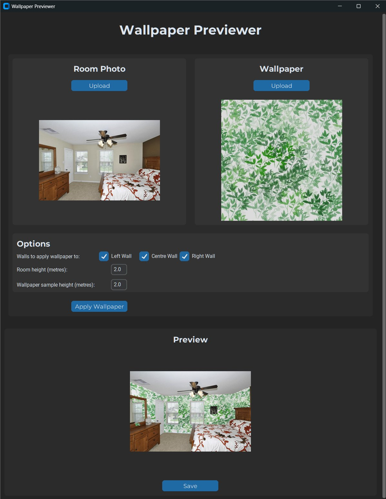

# Wallpaper Previewer

This open-source project presents a functional wallpaper and texture room previewing software that leverages open-source models, running locally. It was submitted as part of the University Dissertation, achieving a First-Class grade, which can be read at <https://drive.google.com/file/d/1PVYoZnT21Wru38vmFbLnHsOMBOreMvup/view?usp=drive_link>.

## Demo Images

<table width="100%">
    <tr>
        <td width="50%" valign="top" style="padding-right: 16px;">
            
            <p style="text-align: center;"><em>Figure: The wallpaper previewing mode in the app after a sample input image is uploaded and the output image generated.</em></p>
        </td>
        <td width="50%" valign="top">
            
            <p style="text-align: center;"><em>Figure: High-Level Architecture of the wallpaper previewing pipeline.</em></p>
            
            <p style="text-align: center;"><em>Figure: High-Level Architecture of the previewing system with texture rendering pipeline.</em></p>
        </td>
    </tr>
</table>

## Project Structure

```
Wallpaper-Previewer/
│
├── external/           # Unmodified external repositories used.
├── adapted/            # External repositories with custom modifications.
├── src/                # Core source code developed for the project.
│   ├── app/            # GUI and surface previewers.
│   ├── interfaces/     # Interfaces for each key system component.
│   ├── models/         # Integration of adapted/external models.
│   └── rendering/      # 3D texture rendering functionality.
│
├── weights/            # Model weights (see below for instructions).
├── tests/              # Unit tests.
├── data/               # Contains sample open licensed input images and wallpapers.
└── evaluation/         # Evaluation scripts used for the dissertation.
```

## Model Weights

Due to large file sizes, model weights must be downloaded directly from their respective authors:

### Room Layout Estimation

<https://github.com/leVirve/lsun-room>  
File: `model_retrained.ckpt`
Place in: `weights/room_layout_estimation`

### Wall Segmentation

<https://github.com/bjekic/WallSegmentation/tree/main/model_weights>  
Files:

- `best_encoder_epoch_19.pth`
- `best_decoder_epoch_19.pth`

Place in: `weights/wall_segmentation`

### Illumination Estimation

<https://github.com/Wanggcong/StyleLight>  
File: `network-snapshot-002000`  
Place in: `weights/illumination_estimation`

### Mirrors

We have also mirrored the above linked weights, in the case that the original links become broken or unavailable: <https://drive.google.com/drive/folders/1PiZ6MWZfN9MBKy2gWIxWbJChZNXbQm6T?usp=sharing>

## Setup Instructions

### Python Version

This software only works on Python 3.11 due to the use of `bpy`.

### Create Virtual Environment

```bash
python -m venv .venv
source .venv/bin/activate   # On Windows: .venv/Scripts/activate
```

### Install Dependencies

```bash
pip install -r requirements.txt
```

## Running the App

```bash
python -m src.app.main
```

## License Compliance

All external and adapted repositories used in this project have been carefully reviewed to ensure license compliance. The corresponding license files are included within each repository in `external/` and `adapted/`.
